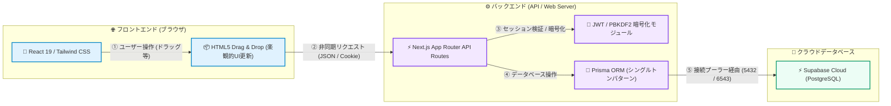
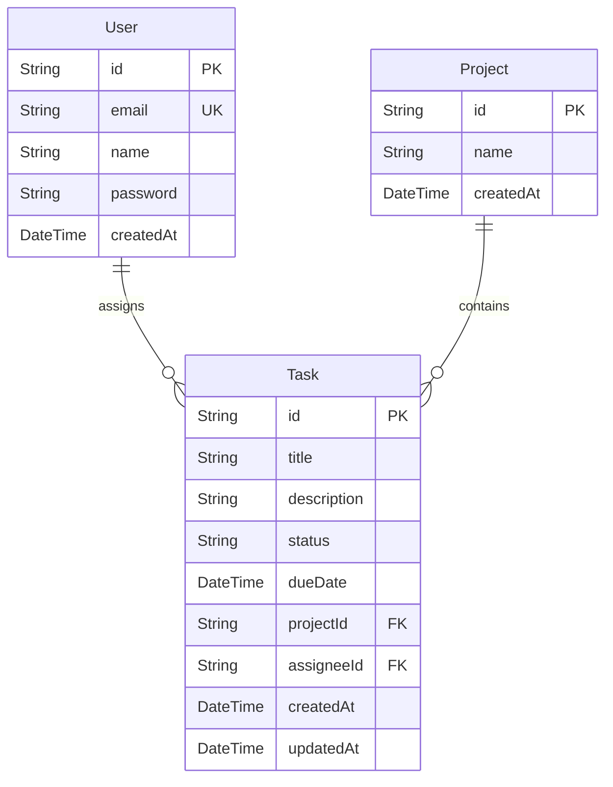

# Asana Clone - プロ仕様タスク管理プラットフォーム

<p align="left">
  
  
  
  
  
  
  
</p>

---

## 🔗 本番デモURL & ログイン情報

### 🚀 **[本番デモサイトはこちら (Vercelで公開中)](https://task-app-asana-clone.vercel.app/)**

### 🔑 デモ用アカウント
* **メインアカウント（山田 太郎）**:
  * メールアドレス: `yamada@example.com`
  * パスワード: `password123`
  * **💡 特徴**: ログイン画面にある「**山田 太郎でクイックログイン**」ボタンを押すことで、ID・パスワードの手間をかけずに1クリックで即座にログインいただけます。
* **新規登録機能**:
  * 「新規アカウント登録」タブに切り替えることで、ご自身のメールアドレスとパスワードでアカウントを作成し、チームメンバーとして即座に参加することも可能です。

---

## ✨ 主な機能とUI/UXへのこだわり

### 1. 2レイアウトビュー（リスト & ボード）
* **リストビュー**: ステータスごとのアコーディオン開閉、期限のカラーアラート、インラインでのタスク即時追加（入力してEnter）など、Asana特有の高速インプットを再現。
* **ボードビュー（カンバン）**: HTML5 Drag & Drop API を用い、カードをドラッグして「未着手」「進行中」「完了」の列へスムーズに移動。

### 2. 独自実装のセキュアなユーザー認証機能（ログイン＆新規登録）
* **ゼロ依存の安全な認証設計**: サーバーレス環境での動作を最適化するため、外部ライブラリ（bcryptやjsonwebtoken等）に依存せず、Node.js標準の `crypto` モジュールで動作する軽量かつ安全な認証を自作。
* **パスワードハッシュ化**: パスワードとソルト（メールアドレス）を合わせた **PBKDF2暗号化** によって、パスワードを強固にハッシュ化しデータベースに保存。
* **JWT & HttpOnly Cookie**: セッションは暗号化JWTとして署名され、ブラウザからはJavaScriptで読み取れない `HttpOnly; SameSite=Lax; Secure` 属性付きCookieとして保存され、改ざんやXSS攻撃から強固に守られます。

### 3. Asanaライクな「タスク受け渡し」機能（10名のチームメンバー）
* **10名の個性豊かなデモメンバー**: データベースにはすでに「鈴木 一郎」「佐藤 美咲」など合計10名の初期チームメンバーが配属されています。
* **担当者の即時変更**: タスク詳細（スライドオーバー）の「担当者」を変更すると、裏側で非同期にAPIが走り、即座に担当が切り替わります（メンバー間のタスク引き継ぎを再現）。
* **「自分に割り当てる」ショートカット**: 自分以外の担当タスクを開いた際、ワンクリックで自分が引き取れる機能。
* **「マイタスク」フィルター**: サイドバーの「マイタスク」を押すことで、プロジェクトを横断して自分にアサインされたタスクのみをフィルタリング表示可能。

### 4. 操作感（マイクロインタラクション）の徹底的な改善
* **ドラッグ時ゴーストイメージの改善**: ドラッグ開始時に `setTimeout`（非同期ディレイ）を用いて状態を切り替えることで、ブラウザが「元のくっきりとしたカード」のゴースト像をキャプチャし、**掴んでいる手元の視認性を100%確保**しつつ、元の位置のカードのみを綺麗に半透明化します。
* **枠外クリックでの自動保存＆クローズ**: タスク詳細を編集した際、パネル以外の場所（背景の薄暗い部分）や「X」ボタンをクリックすると、**変更内容が自動でデータベースに即座に保存（PATCH）されてからパネルが閉じる**シームレスなUXを実装。

---

## 🏗️ システムアーキテクチャ

本アプリケーションは、Next.jsのAPI Routes（Route Handlers）を活用し、余計な外部サーバーを使わない「Next.js + Supabase」の効率的なサーバーレス・Web3層構造で完結しています。



### 📊 データベース定義 (ER図)

Prismaによるデータベーススキーマ定義は以下の通り設計しています。



---

## 🛠️ 技術スタック

* **コア技術**: TypeScript, React 19, Next.js 16.2 (App Router)
* **スタイリング**: Tailwind CSS v4, Lucide React (アイコン)
* **データベース・ORM**: Supabase (PostgreSQL), Prisma 6.19
* **ホスティング**: Vercel
* **セキュリティ**: pbkdf2Sync / Custom JWT (Node.js crypto)

---

## 💡 技術的なこだわり・工夫点

1. **Prismaの接続管理（Transaction vs Session Mode）＆ IPv4/IPv6の互換性対策**
   * Supabaseのコネクションプーラー（Transaction mode: ポート `6543`）を `DATABASE_URL` に設定し、Vercelなどのサーバーレス環境で同時接続が枯渇するのを防止。
   * Vercel（IPv4のみサポート）からSupabase（デフォルトで直接接続がIPv6のみ）に接続する際のエラーを回避するため、マイグレーション実行用の `DIRECT_URL` には直接接続アドレスではなく、IPv4/IPv6デュアルスタックに対応したプーラーのSession mode（ポート `5432`）を採用。これにより安全かつ安定したスキーマ更新を実現。
2. **自動ビルドプロセスの堅牢化**
   * Vercelのクリーンコンテナ上でビルドを行う際、新しいスキーマに追従したPrismaクライアントが自動で再生成されるよう、`package.json` のビルドスクリプトに `"build": "prisma generate && next build --webpack"` を統合。本番環境への継続的な安全デプロイを自動化。
3. **Prismaクライアントのシングルトンパターン**
   * 開発中にNext.jsのホットリロードによって無駄なPrisma Clientのインスタンスが大量生成され、データベース接続数が枯渇するのを防ぐ設計（`src/lib/prisma.ts`）を適用。
4. **Windows環境におけるTurbopackの互換性対策**
   * 一部のWindows環境でNext.jsのTurbopackネイティブモジュールの読み込みに制限が生じる問題に遭遇した際、即座にWebpackに安全にフォールバックさせる設定を `package.json` に施すことで、ローカル開発および本番ビルドの安定性を担保。

---

## 📖 ローカル起動手順

### 1. 依存関係のインストール
```bash
git clone git@github.com:kojiro-tsuji/task-app-asana-clone.git
cd task-app-asana-clone
npm install
```

### 2. 環境変数の設定 (`.env`)
プロジェクトのルートに `.env` ファイルを作成し、Supabaseの接続文字列を設定します。
```env
DATABASE_URL="postgresql://postgres.[YOUR-PROJECT-REF]:[PASSWORD]@[YOUR-POOLER-HOST].pooler.supabase.com:6543/postgres?pgbouncer=true&connection_limit=1"
# Vercel等のIPv4環境向けに、DIRECT_URLも直接接続（IPv6専用）ではなくプール接続のSession mode（ポート 5432）を使用します
DIRECT_URL="postgresql://postgres.[YOUR-PROJECT-REF]:[PASSWORD]@[YOUR-POOLER-HOST].pooler.supabase.com:5432/postgres"
```

### 3. データベースの更新 & シードデータの挿入
```bash
# テーブルの同期（ローカルDBのクリアを伴う場合は --force-reset を指定）
npx prisma db push

# 10名のデモユーザーおよび初期プロジェクト・タスクの投入
npx prisma db seed
```

### 4. 開発サーバーの起動
```bash
npm run dev
```
起動後、ブラウザで [http://localhost:3000](http://localhost:3000) を開くことでローカルで動作を確認できます。
デモログイン用の `yamada@example.com` / `password123` を使用して動作テストが行えます。
