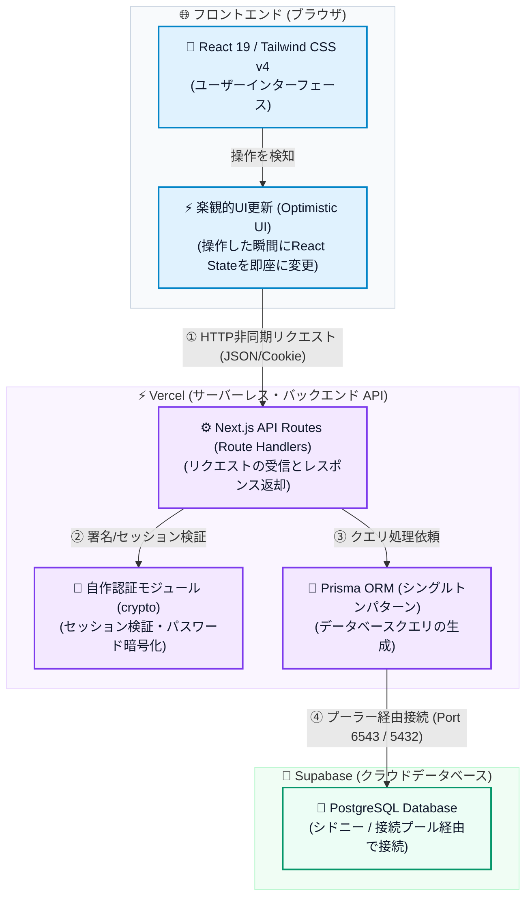
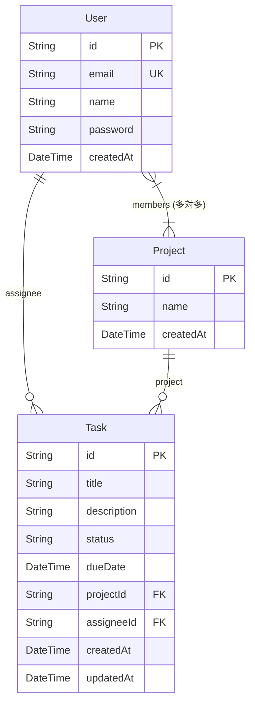

# Asana Clone - プロ仕様タスク管理プラットフォーム

<p align="left">
  
  
  
  
  
  
  
</p>

---

## 🔗 本番デモURL & ログイン情報

### 🚀 **[本番デモサイトはこちら (Vercelで公開中)](https://task-app-asana-clone.vercel.app/)**

### 🔑 デモ用アカウント
* **メインアカウント（山田 太郎）**:
  * メールアドレス: `yamada@example.com`
  * パスワード: `password123`
  * **💡 特徴**: ログイン画面にある「**山田 太郎でクイックログイン**」ボタンを押すことで、ID・パスワードの手間をかけずに1クリックで即座にログインいただけます。
* **新規登録機能**:
  * 「新規アカウント登録」タブに切り替えることで、ご自身のメールアドレスとパスワードでアカウントを作成し、チームメンバーとして即座に参加することも可能です。

---

## ✨ 主な機能とUI/UXへのこだわり

### 1. 2レイアウトビュー（リスト & ボード）
* **リストビュー**: ステータスごとのアコーディオン開閉、期限のカラーアラート、インラインでのタスク即時追加（入力してEnter）など、Asana特有の高速インプットを再現。
* **ボードビュー（カンバン）**: HTML5 Drag & Drop API を用い、カードをドラッグして「未着手」「進行中」「完了」の列へスムーズに移動。
* **完了タスクの打消し線表示**: ボードビューやリストビューでステータスが「完了（DONE）」のタスクには、自動で打消し線（`line-through`）が入り、一目で進捗がわかるよう視覚的アクセシビリティを強化。

### 2. プロジェクトメンバー管理機能（多対多リレーション）
* **メンバー一覧と招待**: プロジェクト上部からメンバー管理画面を開き、現在参加中のメンバーをイニシャルアイコン付きで確認可能。
* **インクリメンタルサーチ (リアルタイム検索追加)**: ユーザーの名前やメールアドレスの一部を入力すると、システム全ユーザーから未参加のメンバー候補をリアルタイムで部分一致検索。検索されたユーザー候補をクリックするだけで即時追加できます。
* **ワンクリック削除**: 参加メンバー一覧から、任意のユーザーをゴミ箱アイコン1つで簡単にプロジェクトから削除（脱退）させることができます。
* **アサイン候補のプロジェクト限定化**: タスク新規作成や詳細画面において、アサインできる担当者候補が「そのタスクが属するプロジェクトの参加メンバー」のみになるよう動的に制御（マイタスクビュー等のプロジェクト横断画面でも、タスクごとに整合して候補リストが自動で切り替わります）。

### 3. 独自実装のセキュアなユーザー認証機能（ログイン＆新規登録）
* **ゼロ依存の安全な認証設計**: サーバーレス環境での動作を最適化するため、外部ライブラリ（bcryptやjsonwebtoken等）に依存せず、Node.js標準の `crypto` モジュールで動作する軽量かつ安全な認証を自作。
* **パスワードハッシュ化**: パスワードとソルト（メールアドレス）を合わせた **PBKDF2暗号化** によって、パスワードを強固にハッシュ化しデータベースに保存。
* **JWT & HttpOnly Cookie**: セッションは暗号化JWTとして署名され、ブラウザからはJavaScriptで読み取れない `HttpOnly; SameSite=Lax; Secure` 属性付きCookieとして保存され、改ざんやXSS攻撃から強固に守られます。

### 4. 徹底した体感レイテンシ排除（楽観的UI更新 / Optimistic Updates）
* **バックグラウンド非同期処理**: Supabaseデータベースサーバーがシドニー（ap-southeast-2）にあることによる、日本からの接続の地理的遅延（3〜4秒）を克服するため、以下の主要トランザクションすべてに**楽観的UI更新**を導入。
  * タスクの新規作成、削除
  * タスク詳細の保存
  * ドラッグ＆ドロップによる列移動、チェックボックス切り替え
* 操作した瞬間にUIの状態（メモリ上のReact state）を即座に変更してパネルを閉じる/移動させ、実際のAPIのPATCH/POSTリクエストやリスト再取得はバックグラウンドで非同期に（`await`せずに）実行。通信遅延を全く感じさせない「体感レイテンシ0秒」の快適な操作性を実現。

### 5. 操作感（マイクロインタラクション）の向上
* **ドラッグ時カーソル消失バグの回避**: `cursor-grab` 等のカスタムカーソル画像ロードによるブラウザの描画ラグ（カーソルが約1秒間消えてしまう現象）を解決するため、標準の `cursor-pointer`（ホバー時）と `cursor: pointer`（ドラッグ中）に最適化し、カードにかかっていた不要な `transition-all` 干渉を排除。安定したカーソル表示を維持。

---

## 🏗️ システムアーキテクチャ

本アプリケーションは、Next.jsのAPI Routes（Route Handlers）を活用し、余計な外部サーバーを使わない「Next.js + Supabase」の効率的なサーバーレス・Web3層構造で完結しています。



### 📊 データベース定義 (ER図)

Prismaによるデータベーススキーマ定義は以下の通り設計しています（多対多リレーションを含む）。



---

## 🛠️ 技術スタック

* **コア技術**: TypeScript, React 19, Next.js 16.2 (App Router)
* **スタイリング**: Tailwind CSS v4, Lucide React (アイコン)
* **データベース・ORM**: Supabase (PostgreSQL), Prisma 6.19
* **ホスティング**: Vercel
* **セキュリティ**: pbkdf2Sync / Custom JWT (Node.js crypto)

---

## 💡 技術的なこだわり・工夫点

1. **地理的遅延をカバーするフロントエンド設計（楽観的UI / Optimistic UI）**
   * **課題**: Supabaseサーバーが日本国外（シドニー）にあるため、APIの通信往復に数百ミリ秒〜数秒のレイテンシが発生し、ボタンの連打や頻繁な操作時にUIがカクつく、または待たされる問題がありました。
   * **解決**: 主要なタスク操作（ドラッグ＆ドロップによるステータス移動、チェックボックスでの完了切り替え、タスク詳細の編集、タスク削除）のすべてにおいて、APIリクエストを `await` せずにバックグラウンド処理にし、**React State（tasks）を瞬時に書き換える楽観的UI更新**を導入しました。これにより「体感レイテンシ0秒」でサクサク動く操作感を実現しつつ、APIが失敗した場合には自動で元のステートにフォールバック（再同期）する強固なデータ整合性設計を採用しています。
2. **タスクの作成・更新・移動におけるトランザクション＆状態管理**
   * **課題**: インラインでのタスク連続作成、詳細モーダルからの複数フィールド同時更新、リスト/ボードビュー間でのタスク移動など、タスク操作の多様なフローにおいて「作成したばかりのタスクにリレーション先のProjectやAssigneeの情報が一時的に欠落する」「更新完了前に別の操作をされた時に状態がズレる」といった非同期処理特有の競合バグが懸念されました。
   * **解決**: 
     * **リレーション情報の瞬時マージ**: モーダルから保存（PATCH）した瞬間に、現在メモリ上にあるプロジェクト一覧やユーザー一覧から該当するオブジェクト（`project` や `assignee`）を見つけ出し、React state側で手動マージした上で即座にリストに反映。
     * **段階的データ同期**: ローカル状態を即座に更新後、APIからの返り値を待って、データベース上の正規データと非同期で再同期（`refreshTasks` / `refreshProjects`）することで、画面のチラつき（フラッシュ）を完全に排除しつつ、バックエンド側の最新の関連データとの競合を防いでいます。
3. **Supabase × Vercel 連携における IPv4 vs IPv6 接続制限問題**
   * **課題**: Supabaseはプラットフォームのモダナイズに伴い、データベースへの直接接続（Port `5432`）がデフォルトで **IPv6専用** となっています。しかし、ホスティング先である Vercel の Serverless Functions 環境は現時点で IPv4 アウトバウンド通信のみをサポートしており、直接接続を使用すると `PrismaClientInitializationError: Can't reach database server` が発生し、本番環境のみAPIが全滅する深刻な接続制限問題に直面しました。
   * **解決**:
     * **コネクションプーラー（PgBouncer）の全面採用**: IPv4接続に対応しているSupabaseのコネクションプーラーアドレスを経由するように設計を変更。
     * **Transaction vs Session Modeの使い分け**:
       * アプリ内のAPIクエリ用の `DATABASE_URL` には、プール上限による接続枯渇を防止するため、プール効率の高い **Transaction Mode (Port 6543)** を採用し、`?pgbouncer=true&connection_limit=1` を指定。
       * 一方、Prismaのスキーママイグレーション（`prisma db push`）やシード実行（`prisma db seed`）はTransaction Modeでは非対応なSQL文を実行するため、直接接続の代わりに同じくIPv4接続に対応したプーラーの **Session Mode (Port 5432)** を `DIRECT_URL` として指定。
     * これにより、サーバーレス環境特有のデータベース接続制限と、IPv4/IPv6のネットワーク互換性問題を完全に克服しました。
4. **自動ビルドプロセスの堅牢化**
   * Vercelのクリーンコンテナ上でビルドを行う際、新しいスキーマに追従したPrismaクライアントが自動で再生成されるよう、`package.json` のビルドスクリプトに `"build": "prisma generate && next build --webpack"` を統合。本番環境への継続的な安全デプロイを自動化。
5. **Prismaクライアントのシングルトンパターン**
   * 開発中にNext.jsのホットリロードによって無駄なPrisma Clientのインスタンスが大量生成され、データベース接続数が枯渇するのを防ぐ設計（`src/lib/prisma.ts`）を適用。
6. **Windows環境におけるTurbopackの互換性対策**
   * 一部のWindows環境でNext.jsのTurbopackネイティブモジュールの読み込みに制限が生じる問題に遭遇した際、即座にWebpackに安全にフォールバックさせる設定を `package.json` に施すことで、ローカル開発および本番ビルドの安定性を担保。

---

## 📖 ローカル起動手順

### 1. 依存関係のインストール
```bash
git clone git@github.com:kojiro-tsuji/task-app-asana-clone.git
cd task-app-asana-clone
npm install
```

### 2. 環境変数の設定 (`.env`)
プロジェクトのルートに `.env` ファイルを作成し、Supabaseの接続文字列を設定します。
```env
DATABASE_URL="postgresql://postgres.[YOUR-PROJECT-REF]:[PASSWORD]@[YOUR-POOLER-HOST].pooler.supabase.com:6543/postgres?pgbouncer=true&connection_limit=1"
# Vercel等のIPv4環境向けに、DIRECT_URLも直接接続（IPv6専用）ではなくプール接続のSession mode（ポート 5432）を使用します
DIRECT_URL="postgresql://postgres.[YOUR-PROJECT-REF]:[PASSWORD]@[YOUR-POOLER-HOST].pooler.supabase.com:5432/postgres"
```

### 3. データベースの更新 & シードデータの挿入
```bash
# テーブルの同期（ローカルDBのクリアを伴う場合は --force-reset を指定）
npx prisma db push

# 10名のデモユーザーおよび初期プロジェクト・タスクの投入
npx prisma db seed
```

### 4. 開発サーバーの起動
```bash
npm run dev
```
起動後、ブラウザで [http://localhost:3000](http://localhost:3000) を開くことでローカルで動作を確認できます。
デモログイン用の `yamada@example.com` / `password123` を使用して動作テストが行えます。
